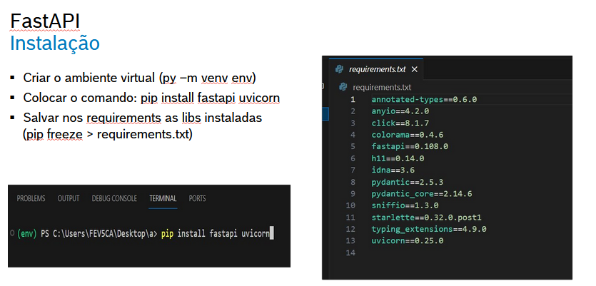
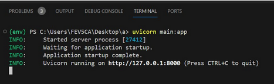
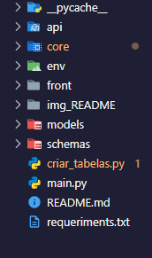

- DATA injest
- testando
## instalar env


- Dentro do código devemos criar os métodos para construir nossa API, devemos criar um método GET que vai nos
retornar uma mensagem, para isso construímos o seguinte código:​

```py
from fastapi import FastAPI​

app = FastAPI()im​

@app.get("/") ​
 def raiz(): ​
    return {"msg": 'Deu certo :P’}​

```
- Dessa forma, conseguimos retornar uma mensagem, porém precisamos rodar nossa aplicação, ai que entra a segunda Lib o uvicorn

## Rodando o código​



#
**CRIAR AS PASTAS**
-core
-models
-schemas
-api
-front


##

**dentro do `core / configs `criar os arquivos**

```python 
from pydantic.v1 import BaseSettings
from sqlalchemy.orm import declarative_base

class Settings(BaseSettings):
    
    API_V1_STR: str = "/api/v1"
    DB_URL: str = "mysql+asyncmy://root@127.0.0.1:bob_esponja"
    DBBaseModel = declarative_base()
    
class config:
    case_sensitive = False
    env_file = "env"
    
Settings = Settings()

confirgurar o configs...
```
##

**core / detabse**

```python
from sqlalchemy.orm import sessionmaker
from sqlalchemy.ext.asyncio import create_async_engine, AsyncEngine, AsyncSession
from core.configs import Settings

engine: AsyncEngine = create_async_engine(Settings.DB_URL)
Session: AsyncEngine = sessionmaker(
    autocommit=False,
    autoflush=False,
    expire_on_commit=False,
    class_=AsyncSession,
    bind=engine
)
```
##


**core / deps.py**
```python
from typing import Generator
from sqlalchemy.ext.asyncio import AsyncSession
from core.databse import Session

async def get_session() -> Generator:
    Session: AsyncSession = Session()
    try:
        yield Session
    finally:
        await Session.close()

```
##

**pasta models**
- dentro da pasta models criar arquivo 
- models / bob_esponja_model.py

```python

from core.configs import Settings
from sqlalchemy import Column, Integer, String

class BobModel(Settings.DBBaseModel):
    __tablename__ = "personagens"
    
    id: int = Column(Integer(), primary_key=True, autoincrement=True)
    nome: str = Column(String(256))
    cor: str = Column(String(256))
    personalidade = str = Column(String(256))
    casa: str = Column(String(256))
    foto: str = Column(String(256))
```
##

**pasta schemas**
 
- criar arquivo bob_schema.py
```python
from typing import Optional
from pydantic import BaseModel as SCBaseModel

class BobSchema(SCBaseModel):
    
    id: Optional[int] = None
    nome: str
    cor: str
    persolidade: str
    casa: str
    foto: str
    
    class Config:
        orm_mode = True
```
##

- criar all_models.py


##

**Criação de pastas na pasta API, voce deve criar pastas**

- api / v1 / endpoints / bob_esponja.py
- dentro da pasta v1 criar `v1 / api.py`

##


**codigo endpoints / bob_esponja.py**
```python
from typing import List 
from fastapi import APIRouter, status, Depends, HTTPException, Response

from sqlalchemy.ext.asyncio import AsyncSession
from sqlalchemy.future import select

from models.bob_esponja_model import BobModel
from schemas.bob_schema import BobSchema
from core.deps import get_session

router = APIRouter()

@router.post("/", status_code=status.HTTP_201_CREATED, response_model=BobSchema)
async def post_bob(bob: BobSchema, db: AsyncSession = Depends(get_session)):
    novo_personagem = BobModel(nome=bob.nome, cor=bob, 
                               personalidade=bob.persolidade,
                               casa=bob.casa, foto=bob.foto)
    db.add(novo_personagem)
    await db.commit()
    return novo_personagem

@router.get("/", response_model=List[BobSchema])
async def gte_bobs(db:AsyncSession = Depends(get_session)):
    async with db as session:
        query = select(BobModel)
        result = await session.execute(query)
        personagens: List[BobModel]  = result.scalars().all()
    
        return personagens
    
@router.("/{bob_id}", response_model=BobSchema)
async def get_bob(bob_id: int, db: AsyncSession = Depends(get_session)):
    async with db as session:
        query = select(BobModel).filter(BobModel.id == bob_id)
        result = await session.execute(query)
        personagem = result.scalar_one_or_none()
        
        if personagem:
            return personagem
        else:
            raise HTTPException(detail="Personagem não encontrado",
                                status_code=status.HTTP_404_NOT_FOUND)
            
@router.put("/{bob_id}", response_model=BobSchema, status_code=status.HTTP_202_ACCEPTED)
async def put_bob(bob_id: int, bob: BobSchema, db: AsyncSession = Depends(get_session)):
    async with db as session:
        query = select(BobModel).filter(BobModel.id == bob_id)
        result = await session.execute(query)
        personagem = result.scalar_one_or_none()
        
    if personagem_up:
        personagem_up.nome = bob.nome
        personagem_up.cor = bob.cor
        personagem_up.personalidade = bob.persolidade
        personagem_up.casa = bob.casa
        personagem_up.foto = bob.foto
        
        await session.commit()
        return personagem_up
    
    else:
        raise HTTPException(detail="Personaem não encontrado",
                            status_code=status.HTTP_404_NOT_FOUND)
```
## 

-- python -m uvicorn main:app para rodar...